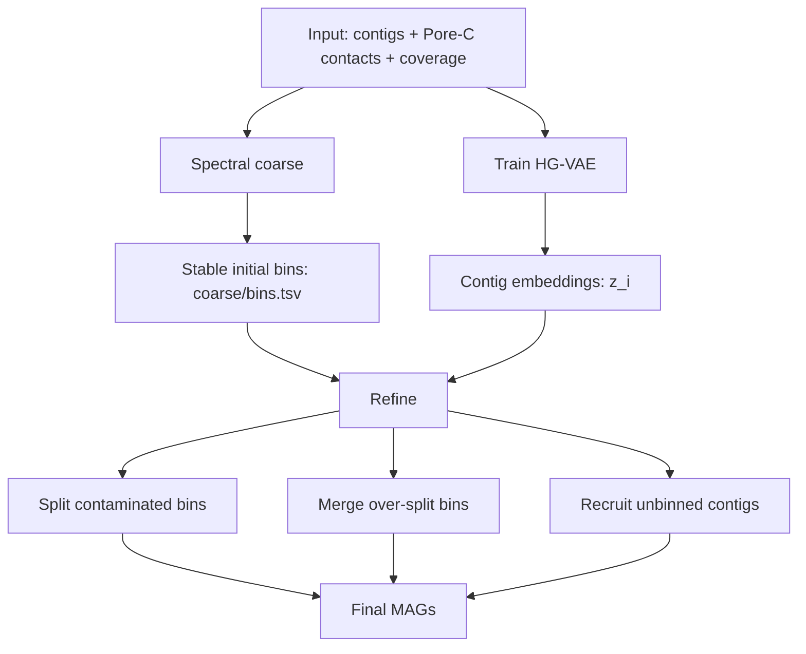

# HG-VAE Embedding-Assisted Refine Strategy

Updated: 2026-06-24

This note records the current design decision after comparing the spectral and
HG-VAE coarse routes with CheckM2. It is a planning document for the next code
changes. The goal is to keep the method conservative, interpretable, and
efficient.

## 1. Decision

The recommended mainline should be:

```text
spectral coarse + HG-VAE embedding-assisted refine
```

HG-VAE should not be the default coarse clustering route for now. It remains in
the tool, but its default role becomes an unsupervised similarity embedding used
by refinement.

In other words:

```text
spectral embedding -> HDBSCAN -> coarse/bins.tsv
HG-VAE embedding   -> hyperedge_embedding.tsv -> refine evidence
```

The pure HG-VAE coarse route can stay available as an experimental or ablation
route:

```text
HG-VAE embedding -> HDBSCAN -> coarse/bins.tsv
```

but it should not be the main recommended route until it becomes more stable.

## 2. Why

The current CheckM2 comparison suggests that HG-VAE contains useful signal but
is too permissive as the direct coarse clustering source.

Observed result:

```text
Spectral final:
  HQ-like = 4
  MQ-like = 5
  Low     = 175

HG-VAE final:
  HQ-like = 2
  MQ-like = 12
  Low     = 723
```

Interpretation:

- HG-VAE recovers more MQ-like bins, so the learned representation is useful.
- HG-VAE also produces far more low-quality bins, so using it directly as the
  coarse clustering source is currently unstable.
- Spectral is more conservative and yields fewer low-quality bins.
- The safest near-term design is to let spectral provide stable initial bins
  and let HG-VAE provide action-level similarity evidence.

## 3. Mainline



Short explanation:

```text
Spectral decides the first bin assignment.
HG-VAE does not directly decide bins.
HG-VAE only tells refine which contigs and bins look similar.
```

## 4. Evidence Roles

Spectral:

- produces the stable coarse bins;
- remains the default `coarse/bins.tsv` source.

HG-VAE:

- learns a latent vector `z_i` for each contig;
- uses TNF and coverage reconstruction as the feature anchor;
- uses Pore-C hyperedges as latent-space regularization;
- supplies an unsupervised similarity space for refine.

SCG:

- detects likely mixed bins through duplicated markers;
- protects merge and recruit from obvious biological conflicts.

Pore-C:

- supplies structural support for split, merge, and recruit;
- remains hypergraph-native and is not replaced by pairwise weights.

## 5. HG-VAE Quantities

For each contig `i`, HG-VAE provides:

```text
z_i = latent embedding of contig i
```

For each current bin `b`, refine computes:

```text
mu_b  = centroid of z_i for contigs in bin b
rho_b = median(||z_i - mu_b||) + 3 * MAD(||z_i - mu_b||)
```

Purpose:

- `mu_b` is the bin center in HG-VAE space.
- `rho_b` is a robust bin radius.
- A contig is HG-VAE-compatible with a bin when it falls inside or near this
  robust radius.

For recruit target search, use the radius-normalized distance:

```text
score(i,b) = ||z_i - mu_b|| / (rho_b + eps)
```

Purpose:

- bins with naturally wider or tighter embedding spread are compared fairly;
- the selected HG-VAE target is the bin with the smallest `score(i,b)`.

## 6. Refine Actions

### Split

Trigger:

```text
a bin has duplicated canonical SCG markers
```

Candidate generation:

```text
duplicated SCG carrier contigs -> HG-VAE seeded k-means -> candidate children
```

Decision:

```text
SCG says the bin is suspicious.
HG-VAE proposes a split direction.
Pore-C checks whether the children are contact-separated.
```

Accept only when the split is structurally valid, improves SCG burden, and is
supported by Pore-C separation.

### Merge

Candidate generation:

```text
Pore-C finds mutual-best contact-supported bin pairs
```

HG-VAE compatibility:

```text
||mu_a - mu_b|| <= rho_a + rho_b
```

Decision:

```text
Pore-C says two bins are strongly connected.
SCG says merging does not introduce duplicated markers.
HG-VAE says the two bin regions overlap.
```

Accept only when all three conditions agree.

### Recruit

Scope:

```text
only contigs that are still unbinned
```

Target selection:

```text
b_contact = best Pore-C supported target bin
b_hgvae   = argmin_b score(i,b)
```

Decision:

```text
recruit contig i only if b_contact == b_hgvae
and ||z_i - mu_b|| <= rho_b
```

If Pore-C and HG-VAE disagree, keep the contig unbinned.

## 7. Implementation Plan

Current implementation status:

```text
step 1 metadata role fields: implemented
step 2 recommended command/documentation semantics: implemented
step 3 radius-normalized HG-VAE recruit target selection: implemented
step 4 action-note and run-metadata HG-VAE evidence audit fields: implemented
```

1. Keep `spectral` as the default coarse method.
2. Make the recommended mainline train HG-VAE with `--hyperedge-embedding`.
3. Clarify metadata fields:

```text
coarse_method = spectral
coarse_embedding_source = joint_spectral
hgvae_role = refine_embedding
refine_embedding_source = hgvae
```

For the experimental route:

```text
coarse_method = hgvae
coarse_embedding_source = hgvae
hgvae_role = experimental_coarse
```

4. Keep `coarse/bins.tsv` controlled by spectral in the recommended route.
5. Use HG-VAE only in refine gates:

```text
split   -> seeded split direction
merge   -> bin-region overlap check
recruit -> Pore-C/HG-VAE target agreement
```

6. Update README, architecture docs, refine design docs, metadata tests, and
   CLI help text so users understand that HG-VAE is evidence in the default
   mainline, not the default coarse clustering source.

## 8. Recommended Command

The recommended development and benchmarking command should become:

```bash
porebin bin \
  --contigs contigs.fasta \
  --contacts evidence/contacts.parquet \
  --coverage-tsv evidence/coverage.tsv \
  --coarse-method spectral \
  --hyperedge-embedding \
  --out run_spectral_hgvae_refine
```

The pure HG-VAE coarse route remains available for ablation:

```bash
porebin bin \
  --contigs contigs.fasta \
  --contacts evidence/contacts.parquet \
  --coverage-tsv evidence/coverage.tsv \
  --coarse-method hgvae \
  --out run_hgvae_ablation
```

## 9. One-Sentence Summary

Use spectral to make stable initial bins, use HG-VAE as a learned similarity
map, and let SCG, Pore-C, and HG-VAE jointly but conservatively refine the
result.
